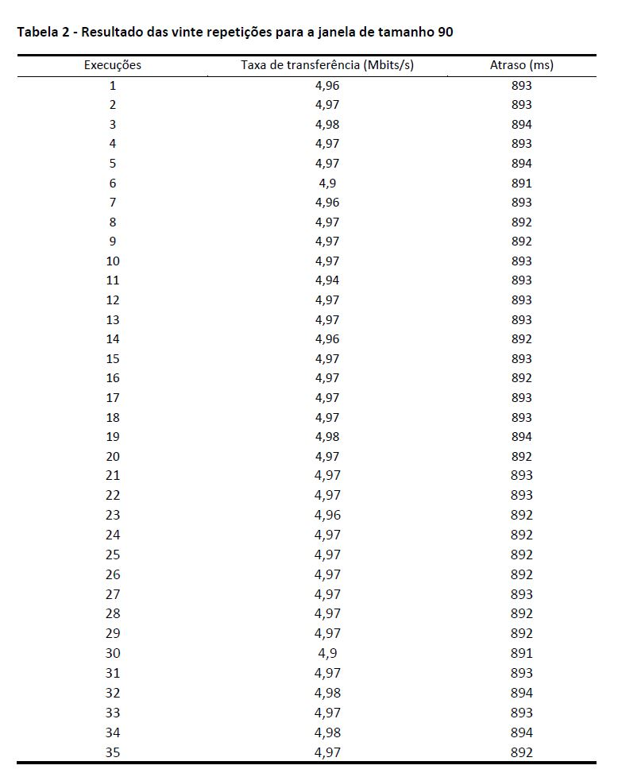
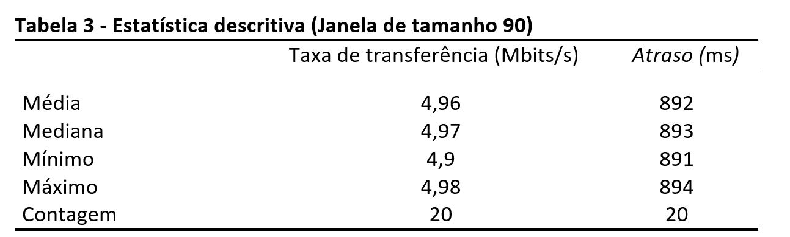
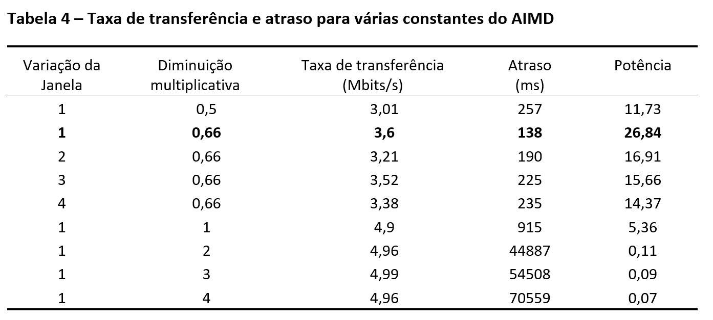
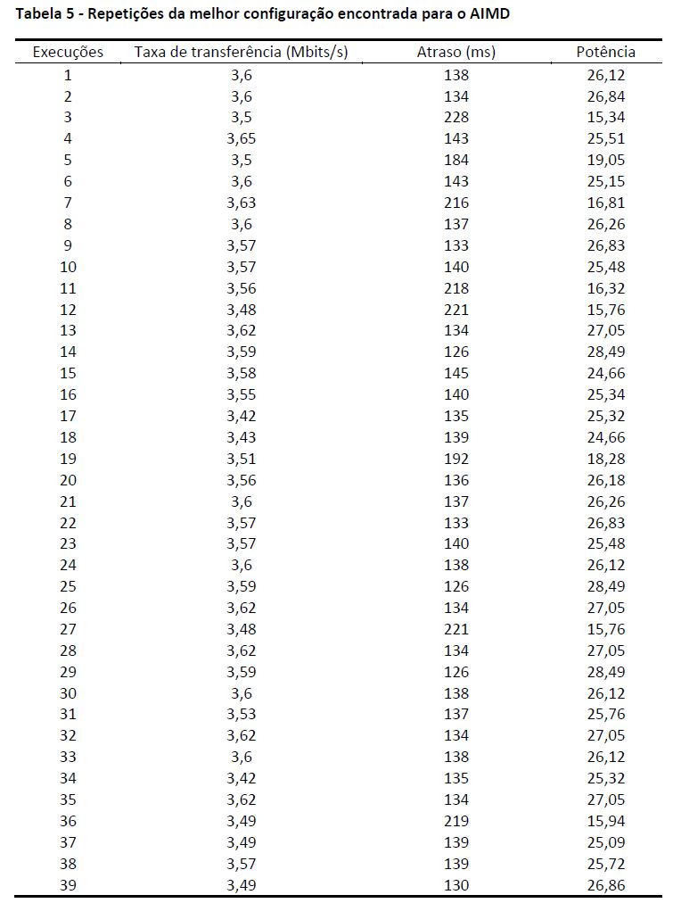
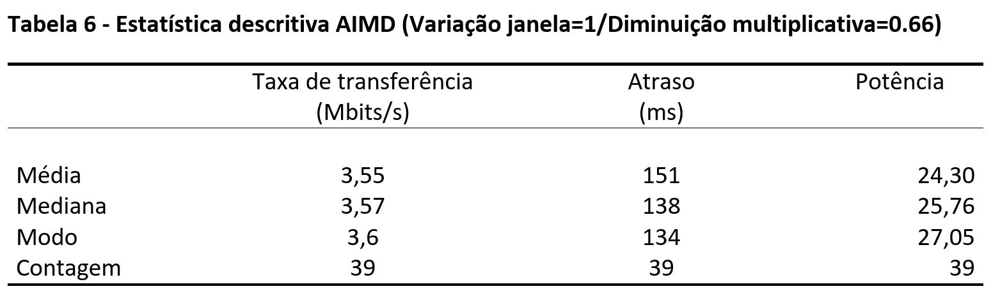
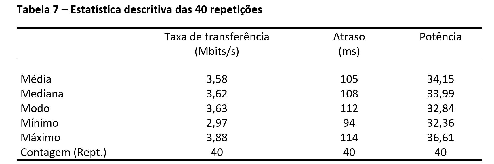

**Exercício de aquecimento A [10%]: Varie o tamanho da janela fixa editando controller.cc para ver o que acontece. Faça um gráfico 2D de taxa de transferência versus um atraso no sinal com percentil de 95 a medida que você altera esse valor. Qual é o melhor tamanho de janela única que você pode encontrar para maximizar a potência (taxa de transferência/atraso)? Quão repetíveis são as medições feitas com o mesmo tamanho de janela em várias execuções?**

Para entender o comportamento do sistema foram testados vários tamanhos de janela com um intervalo incremental de tamanho 5. A Tabela 1 apresenta o resultado de cada simulação e a potência que foi calculada a partir da taxa de transferência e o atraso.

     

Os valores obtidos durante as simulações (por janela) foram utilizados para gerar os gráficos apresentados abaixo. A figura 1 apresenta o gráfico 2D da taxa de transferência versus o atraso no sinal com percentil de 95. 

     

Para melhor compreensão dos resultados, foi gerado o gráfico (Figura 2) para a potência versus o tamanho da janela.

     

Conforme pode ser observado na figura 1, ao passo que a taxa de tranferência é aumentada é constatado um maior atraso. O gráfico da potência (Figura 2) mostrou que a janela de tamanho 15 foi a que apresentou os melhores resultados. Para analisar quão repetíveis são as medições feitas com o mesmo tamanho de janela em várias execuções, foram realizadas 35 repetições para o tamanho de janela 90. A tabela 2 apresenta o resultado de cada execução e a Tabela 3 apresenta uma análise dos dados utilizando estatística descritiva.

     

     

 Após observar a tabela 2 concluiu-se que os dados são bastante repetíveis (apenas 5 valores distintos para a taxa de transferência e 4 para o atraso). Na estatística descritiva (Tabela 3) é possível observar que o intervalo entre o valor mínimo e máximo é pequeno, indicando que não há grandes variações nos resultados. A média e mediana também são muito próximas (poucos centésimos de Mbits/s e Ms), deste modo, ambas podem ser utilizadas para representar a taxa de transferência e o atraso para a janela.

**Exercício de aquecimento B [40%]: Implemente um esquema AIMD simples, semelhante a fase de prevenção de congestionamento do TCP. Quão bem isso funciona? Quais constantes você escolheu.**

 Para este exercício foi implementado um esquema simples de ajuste da janela de congestionamento que imita o comportamento do AIMD (_Additive Increase, Multiplicative Decrease_). Este mecanismo reage ao congestionamento de acordo com a largura de banda (detectada) utilizando a seguinte abordagem: Quando não há indicação de perda o remetente aumenta taxa de transmissão (tamanho da janela em 1 slot/RTT), sondando a capacidade utilizável. Quando há um indício de congestionamento (detecção da perda) ocorre a diminuição multiplicativa (janela de congestionamento é reduzida). Nesta implementação foram utilizadas as variáveis Diminuição Multiplicativa e a Variação da Janela, estes valores são estáticos e fixados manualmente. O tamanho _threshold_ foi configurado de acordo com os melhores resultados de atraso obtido no exercício A. Foram realizadas várias simulações alterando os valores das variáveis Diminuição Multiplicativa/Variação da Janela, os resultados da performance são apresentados na Tabela 4.

     

 Para a construção da Tabela 4, foram testadas as Variações da janela com os valores 1, 2, 3 e 4 e a Diminuição multiplicativa com 0.5, 0.6, 1, 2, 3 e 4. Os resultados mostram que a melhor configuração encontrada é a Variação da janela = 1 e a Diminuição multiplicativa = 0.66 para confirmar este resultado, a simulação com esta configuração foi repetida mais de 35 vezes. Os resultados destas repetições são apresentados na Tabela 5.

     

A análise estatística dos dados são apresentados na Tabela 6. Ao analisar os resultados obtidos é possível afirmar que esta configuração apresenta a melhor potência quando comparado com as demais (Tabela 4).

     

**Exercício D [50%]: Tente diferentes abordagens e trabalhe para maximizar a potência (compare com os resultados dos demais colegas da sala e tente melhorar). Em seu relatório, explique sua abordagem, incluindo as decisões importantes que você teve que tomar e como você as fez. Inclua gráficos ilustrativos com os resultados.**

Para maximizar a potência o algoritmo foi otimizado para aumentar ou diminuir o tamanho da janela de forma adaptativa. A abordagem é menos agressiva que a apresentada no exercício B com relação ao congestionamento, sendo mais focada no controle e com o objetivo de evitar o congestionamento.  O esquema possui o seguinte funcionamento:  O atraso é calculado a partir do RTT (atraso = tempo do ACK recebido menos o tempo do ACK enviado), se o atraso for maior que o valor estipulado o tamanho da janela é reduzido até a normalização da fila. Caso o atraso seja menor que o valor estipulado, a janela é incrementada.  Em caso de congestionamento, isto é, se após o _timeout_ a janela ainda estiver apresentando um valor alto, o tamanho da janela é dividido pela metade.

  Após encontrar a melhor configuração, a simulação foi repetida 40 vezes para verificar a consistência dos resultados. A estatística descritiva das repetições (Tabela 7) mostra que a variação entre o valor mínimo e máximo é pequena. Com relação à média da potência (34,15), verificou-se que esta implementação apresentou uma melhora no desempenho quando comparado com o esquema proposto no exercício B (24,30).

     

A seguir são apresentados os gráficos gerados em uma das simulações utilizando o melhor cenário encontrado:

     

     

     

**Exercício E [0%]: escolha um nome legal para o seu esquema**

Nome: lih

[http://cs344g.keithw.org/report?Lih-1540948299-faleefei](http://cs344g.keithw.org/report?Lih-1540948299-faleefei)
